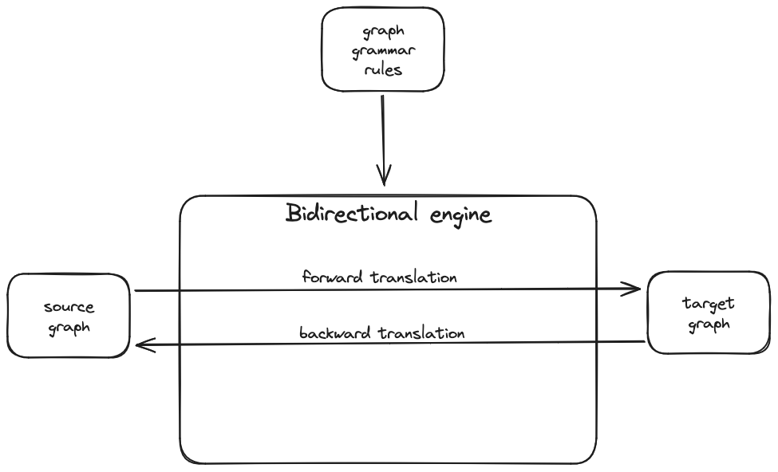

# Triple graph grammar engine

This is an experiment on implementing a very basic engine for triple graph grammars.

The engine is built with a graph grammar, which, just like string grammars, 
consists of a set of production rules.
But these rules transform graphs into other graphs.
These rules establish a correspondence between graphs in two different domains 
(conventionally called "source" and "target").

Once built, the same engine can be used to translate from source to target ("forward" direction)
or from target to source ("backward" direction):
